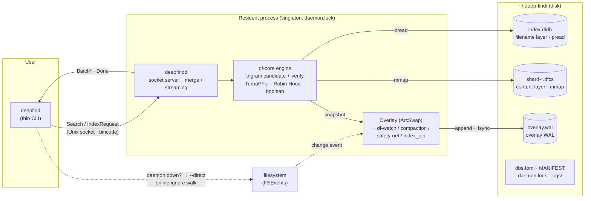
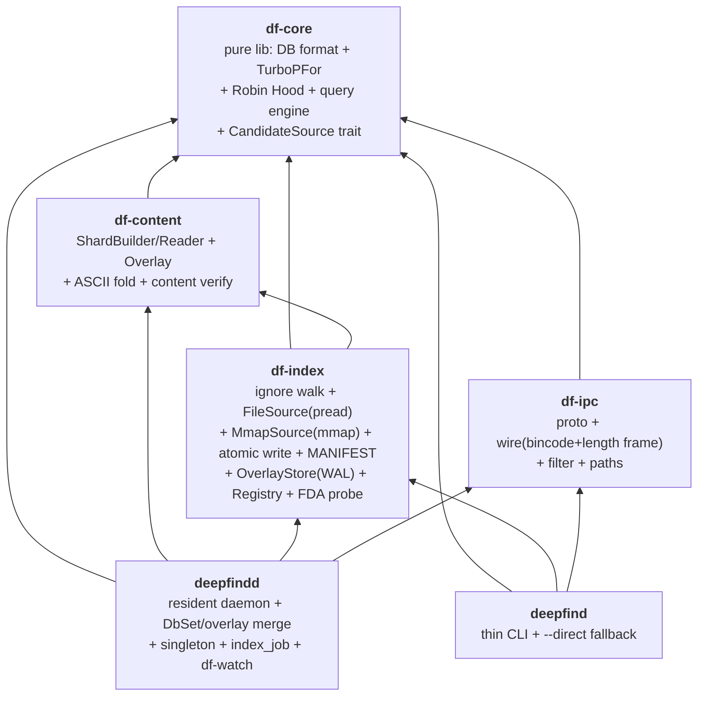
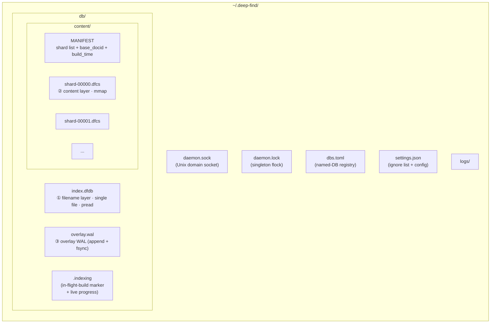
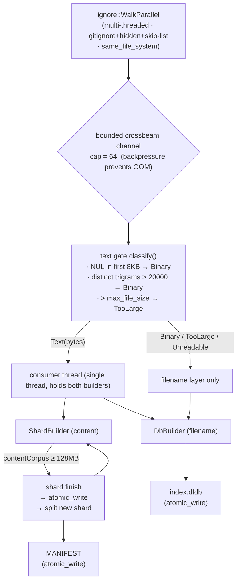
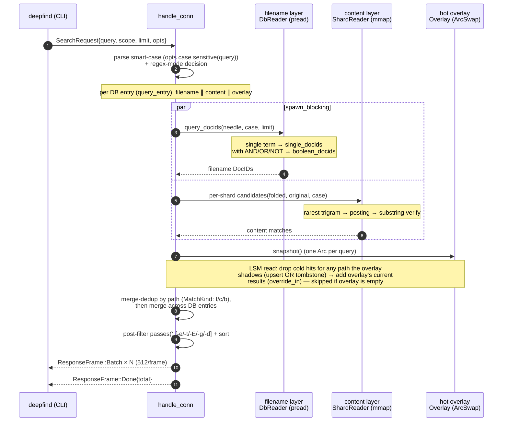
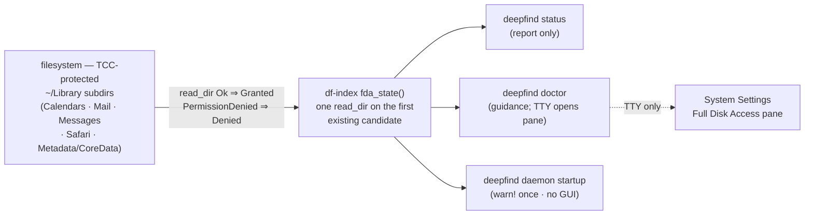

# DeepFind — System Architecture

> **Status:** Updated 2026-06-27 (v0.1.6) to reflect the code **actually built** on `main` (not a design vision). Phases A–F are fully delivered, plus Full Disk Access detection + `deepfind doctor`, **true incremental indexing via an LSM hot overlay (WAL + compaction + safety-net)**, background index builds, the multi-DB registry, a **single-instance daemon guard**, and a **global `settings.json` ignore list + `deepfind config` subcommand**. 193 tests green.
> **In one sentence:** a plocate-style filename index + zoekt-style content shards, behind a single shared trigram candidate engine, served by a resident daemon over a Unix socket to a thin CLI — with an LSM hot overlay absorbing live edits between compactions.
> Diagrams are Mermaid (rendered natively by GitHub / VS Code / GitLab); byte-level on-disk layouts use ASCII.

---

## 1. Overview

DeepFind is a local file-search tool for macOS, targeting fast substring search over **whole-disk filenames + content**. The architecture is a "hybrid" — it borrows one technique from each of several open-source projects and assembles them into a single engine:

| Source | Technique borrowed | Where it lands |
|---|---|---|
| **plocate** | file-level trigram + pread low RSS | the entire filename-layer paradigm |
| **zoekt** | tagged-TOC shard format, boolean, merge-dedup | `.dfcs` content shard, AST, result merging |
| **trigrep** | trigram-accelerated substring verification | shared `candidates()` candidate-gen + verify |
| **lolcate-rs** | mmap + streaming bounded build | `MmapSource`, crossbeam backpressure channel |
| **fd / bfs** | find UX + robust full-disk traversal | CLI flag set, `same_file_system`, permission-error classification |
| **reflex** | mmap fast repeated queries | daemon-resident mmap (cold shards stay mapped) |
| **LSM-tree** (LevelDB/RocksDB) | MemTable + WAL + tiered compaction | the hot `Overlay` + `overlay.wal` + `compact_and_swap` + safety-net |

**Core design principles**

- **Two storage layers, one engine:** the filename layer (pread, low latency) and the content layer (mmap, GB-scale) are stored independently, but share a single "rarest-trigram candidate + substring verify" algorithm through the `CandidateSource` trait.
- **df-core is zero-I/O:** all engine/codec logic operates on a small trait (`DbSource`) implemented by one caller, so it can be unit-tested and benchmarked without a real DB.
- **Resident daemon + thin CLI:** the daemon holds the index handles; the CLI queries over a socket. If the daemon is down, the CLI automatically falls back to `--direct` online scanning, so the user is never blocked.
- **LSM incremental (cold layers + hot overlay):** the cold filename/content layers are immutable on disk; live file edits are folded into an in-memory **`Overlay`** persisted by a **write-ahead log** (`overlay.wal`). Queries read all three and merge by path — overlay entries **override** stale cold hits, tombstones **remove** deleted paths. When the overlay grows past a threshold, a **compaction** rebuilds the cold layers and clears it; a daily **safety-net** rebuild backstops any missed change.

---

## 2. High-level architecture



---

## 3. Crate layering (6 crates, single-directional, acyclic)



| crate | responsibility | key constraint |
|---|---|---|
| **df-core** | DB format, TurboPFor codec, Robin Hood hash, query engine, `CandidateSource` trait | **pure lib, zero I/O** (operates on the `DbSource` trait) |
| **df-content** | `ShardBuilder` / `ShardReader`, pure `Overlay` (LSM MemTable) + `WalRecord` codec, ASCII fold, content substring verify | depends on df-core |
| **df-index** | `ignore` parallel walk, text gating, `FileSource` (pread), `MmapSource` (mmap), atomic write, MANIFEST, **`OverlayStore` (WAL persistence)**, **`Registry` (`dbs.toml`)**, **Full Disk Access probe (`fda_state`)** | depends on df-core + df-content |
| **df-ipc** | `SearchRequest` / `ResponseFrame` proto, bincode + length frame, path filter, default paths | depends on df-core |
| **deepfindd** | resident daemon: `DbSet` (default + registered DBs) with per-entry **filename + content + overlay** query merge, socket server, streaming output, **singleton guard**, **`index_job`** (background builds + progress), **`df-watch`** (overlay + compaction + safety-net) | depends on all |
| **deepfind** | thin CLI: IPC client + `--direct` online fallback + highlight/exec | depends on df-core/df-index/df-ipc |

---

## 4. Dual-layer storage model

Two **fully independent** cold file families — the filename DB and the content shards — live under `~/.deep-find/`, fed simultaneously by a single walk. Beside them sit the daemon's operational files: `overlay.wal` (the hot overlay's WAL, fed by df-watch), `.indexing` (the in-flight build marker), `dbs.toml` (the registry), `settings.json` (the global ignore list + config), and `daemon.lock` (the singleton). The cold on-disk layouts are below; the overlay's in-memory + WAL model is §4.4.



Named DBs (`db add`) repeat the `db/` layout under `db/<name>/` (`index.dfdb` + `overlay.wal` + `content/`); the default DB lives directly under `db/`.

**Why two layers instead of one:** filenames want low latency, low RSS → a single pread file, the daemon never holds the whole DB resident; content wants GB-scale → mmap'd multi-shard, splitting when a shard's `contentCorpus` reaches ~128 MB. The two layers are unified by **the same candidate algorithm**, but their storage / access strategies are entirely different.

### 4.1 Filename DB `index.dfdb` — plocate-style, fully pread

```
┌─ Header 64B ──────────────────────────────────────────────────┐
│ magic "DFDB" | version=2 | num_docs | build_time              │
│ + 6×u64 section offsets: docs / meta / dirmtime(reserved) /   │
│                          try(hash table) / post / slots_log2  │
├───────────────────────────────────────────────────────────────┤
│ DOCS    zstd trained dictionary + block index + zstd-compressed filename blocks (N per block) │
│ META    num_docs × 17B  (is_dir:u8 | size:i64 | mtime:i64)    │
│ HASH    Robin Hood open-addressing table · 20B/slot (key|count|off|len) │
│ POST    TurboPFor (PFor delta · block=128) encoded docids     │
└───────────────────────────────────────────────────────────────┘
```
Queries go through `pread` — the resident footprint is just the dictionary + block index + currently-hit postings; everything else is read on demand.

### 4.2 Content shard `shard-NNNNN.dfcs` — zoekt-style tagged-TOC, fully mmap'd

```
┌─ body (sections back-to-back) ───────────────────────────────┐
│ metaData       version | build_time | base_docid | num_docs … │
│ fileNames      length-prefixed paths                          │
│ fileMeta       17B per doc (same as v1 LiteMeta)              │
│ contentOffsets per-doc u64 offset + u32 length → into corpus  │
│ contentCorpus  raw file bytes, concatenated by docid (~1× disk budget) │
│ ctHash         Robin Hood table (reuses v1 primitives · 20B/slot) │
│ ctPostings     TurboPFor delta-encoded local docids           │
├─ TOC ─────────────────────────────────────────────────────────┤
│ varint tag length + tag + kind + (off, sz)   ← unknown tag skipped │
├─ FOOTER 8B ───────────────────────────────────────────────────┤
│ toc_off | toc_sz        ← read last 8 bytes first to locate   │
└───────────────────────────────────────────────────────────────┘
```
Opened with `memmap2` `MAP_SHARED PROT_READ`; `metaData.base_docid` maps a local docid into the global namespace.

### 4.3 The merged docid model

Each layer keeps its **own local** docid namespace: filename `DbReader` uses `0..N_name`; each content shard uses local docids mapped into a per-DB global space via `base_docid + local`; the overlay uses `0..N_overlay`. Because docids are never compared *across* sources, the overlay's space cannot collide with shard docids. **Dedup and override are path-keyed**, not docid-keyed: all three layers are merged by canonical absolute path (overlay entries override stale cold hits on the same path; tombstones remove them) — no cross-layer string join is needed.

### 4.4 The LSM hot overlay (incremental read/write model)

The cold layers (`index.dfdb` + `shard-*.dfcs`) are **immutable on disk** between rebuilds; live edits land in the overlay. This is a classic tiered LSM, with three roles mapped onto the existing engine:

| LSM role | DeepFind piece | Where |
|---|---|---|
| **MemTable** (absorbs writes) | in-memory `Overlay` — per-path doc + trigram `try_map`, behind an `ArcSwap` | `df-content::overlay` |
| **WAL** (durability) | append-only `overlay.wal` (`u32 len` + bincode `WalRecord`), fsync'd per debounced batch, truncated on compaction | `df-index::overlay_store` |
| **SSTables** (cold, immutable) | the pread filename DB + mmap'd content shards | `df-core::db`, `df-content::shard` |
| **Compaction** (flush MemTable → SST) | `compact_and_swap`: full rebuild subsumes the overlay → reload shards + reload filename layer → `overlay.clear()` + WAL truncate | `deepfindd::compact_and_swap` |

**Write path** (df-watch, debounced ~300ms): classify each changed path → `WalRecord::Upsert{path,meta,content}` (or `Delete`) → `OverlayStore::append` + `sync` → clone-snapshot, `apply_records`, `ArcSwap::store`. A re-upsert drops the doc's old trigram postings first; a delete leaves an inert slot + a tombstone. Threshold (default 2000 entries, `DEEPFIND_COMPACTION_THRESHOLD`) triggers compaction.

**Read path**: the cold layers and the overlay are each queried **independently** through the same `CandidateSource` algorithm (`OverlayReader` implements the trait over the overlay's `try_map`). The daemon merges by path with **standard LSM read semantics** — overlay entries override cold hits on the same path, tombstones suppress them. An empty/freshly-compacted overlay (`shadows_anything() == false`) skips the override pass entirely, so the common query pays nothing.

**Recovery**: on startup the daemon replays `overlay.wal` into a fresh `Overlay`. A half-written tail frame from a crash is silently dropped (decode stops at the first truncated/corrupt frame); the daily **safety-net** rebuild (`rebuild_and_swap`, `DEEPFIND_SAFETY_NET_SECS`, default 24h) backstops any loss by refreshing the cold layer *without* clearing the overlay.

---

## 5. Indexing pipeline (streaming, bounded RSS)

`deepfind index [--root] [--force] [--skip …] [--max-file-size 1MB] [--no-content] [--one-file-system]` → `build_content_index`, which builds **both layers in a single walk**:



- **Text gate** (zoekt DocChecker + trigrep idea): binary / oversized files enter **only the filename layer**, never the content layer.
- **Atomic write** = `tmp → fsync → rename`; a half-written DB is never left behind.
- **One build path, four triggers:** the same `build_content_index` streaming build backs (a) `deepfind index` (on-demand, via `index_job::spawn_build`), (b) daemon-startup builds for registered DBs missing an index (`spawn_if_missing`), (c) **compaction** (`compact_and_swap`, when the overlay overflows), and (d) the **safety-net** periodic rebuild (`rebuild_and_swap`). A single `.indexing` marker (`OpenOptions::create_new`) is the atomic guard across all four, so two builds of the same DB can never interleave shard writes; a `MarkerGuard` removes it on drop, and `sweep_stale_markers` recovers any left by a SIGKILL'd daemon.
- **Incremental is the LSM overlay, not a rescan** (v0.1.5): `df-watch` (notify over FSEvents) folds each debounced change into the hot overlay (§4.4), surfacing in queries within ~1s — a full rebuild only fires on compaction (overlay ≥ threshold) or the daily safety-net. df-watch is **env-gated** (`DEEPFIND_WATCH=1`) and watches **registered DBs only** (a known `root`); the default DB (`index --root`, `root = None`) spawns no watcher.

---

## 6. Query hot path (daemon)



**Regex mode** (`-r/--regex`): the query is treated as a regex and run over **both the filename and content layers** (mirroring literal mode). The longest literal atom drives candidate generation (a case-insensitive superset); `regex.is_match` (over filename windows / mmap'd content bytes) is the authoritative verify; `(?i)` is conditioned by smart-case.

**Candidate generation `candidates()` (shared by both layers):**
1. Extract the query's byte trigrams (folded, matched against the folded index) → always a legal superset, unaffected by case mode;
2. Pick the trigram with the shortest posting → the candidate docid set;
3. Verify each candidate by substring (case-sensitive ⇒ original bytes; otherwise folded bytes);
4. <3-byte queries degrade to a linear scan of the whole DB.

---

## 7. Engine core algorithms (df-core)

| Algorithm | Implementation | Source |
|---|---|---|
| **byte-trigram key** | `(a<<16\|b<<8\|c)` bijective u32, lowercased byte sliding window | plocate · native CJK |
| **rarest-trigram candidate** | take the trigram with the shortest posting → candidate set | plocate / trigrep |
| **substring verify** | `memchr::memmem` (content) / `windows==` (filename) | trigrep |
| **TurboPFor** | **self-written**, scalar PFor delta, block=128, self-describing frame | TurboPFor paper |
| **Robin Hood hash** | splitmix32-style, open addressing, 20B/slot | v1 in-house |
| **boolean AST** | `AND/OR/NOT` + parens + implicit AND | zoekt-style |
| **ASCII fold** | A-Z→a-z (content); filename uses `to_lowercase()` | — |
| **CandidateSource trait** | `cs_posting / cs_verify / cs_num_docs` unifies both layers | this project's abstraction |

---

## 8. IPC protocol (df-ipc)

Unix domain socket (`~/.deep-find/daemon.sock`), `LengthDelimitedCodec` (4-byte length prefix), messages `serde` + `bincode`.

```
enum Request {                   Response frames (daemon → CLI, streaming)
  Search(SearchRequest),         ─────────────────────────────────────
  Index(IndexRequest),           ResponseFrame::Batch    { paths, meta, kind }
}                                ResponseFrame::Lines    { hits }   (-n / -C)
                                 ResponseFrame::Done     { total }
SearchRequest {                  ResponseFrame::Error    { message }
  query, scope, limit, opts, db  ResponseFrame::IndexAck { accepted, message }
}                                SearchOptions:
IndexRequest (P2.3) {              direct, extensions, types, excludes,
  root, skip, max_file_size,       globs, max_depth, regex, case(CaseControl)
  one_file_system, hidden, db
}
```
- Results return as a **batched stream** (512 paths per batch); large result sets arrive incrementally and the CLI prints as it receives.
- `SearchOptions` fields are all `#[serde(default)]` → old/new ends interoperate.
- `MatchKind`: `Filename` / `Content` / `Both` (same path hit in both layers).

---

## 9. CLI surface (current)

```
deepfind index   [--root] [--force] [--skip NAME…] [--max-file-size N]
                 [--no-content] [--one-file-system] [-H/--hidden] [--foreground]
                 # submits a background build to the daemon; --foreground forces
                 # in-process (and is the auto-fallback when the daemon is down)
deepfind daemon
deepfind status
deepfind doctor                 # self-diagnostic: Full Disk Access check + guidance
deepfind db      add <name> <root> [--max-file-size N]
                 remove <name>   |   list
deepfind config  show | ignore add <PATTERN> | ignore remove <PATTERN> | ignore list
                 # manage ~/.deep-find/settings.json (global gitignore ignore list)
deepfind install [--no-watch]      # macOS: install user LaunchAgent (login auto-start + KeepAlive + optional df-watch)
deepfind uninstall                # stop daemon + delete plist
deepfind search <query>
    # match modes
    [-r/--regex | default literal substring]   [-i | -s]   (default smart-case)
    [-p/--full-path | -b/--basename]
    # filters
    [-e EXT] [-t TYPE(code|docs|config|web|archive|media)] [-E EXCLUDE]
    [-g GLOB] [-d N]   [--scope PATH] [--limit N] [--max-results N]
    [--sort default|path|kind|none]   [--expr EXPR]   [--db NAME]
    # content
    [-n/--line-number] [-C N]   [--content | --filename]
    # output
    [-l] [--color always|never|auto] [-0/--null] [--count]
    # fallback / actions
    [--direct]   [-x CMD]   [-H/--hidden]
```

**`--expr`** is a bfs/find-style advanced expression (`-name/-path/-size/-newer` + boolean + parens), evaluated post-query against `(path, LiteMeta)`; it **coexists with** `-e/-t/-E/-g/-d`, it does not replace them. `-n/-C` output goes over a separate `ResponseFrame::Lines` stream (`path:line:text`, grep-aligned).

---

## 10. Full Disk Access detection (operational)

DeepFind reads the whole disk — including TCC-protected `~/Library` subdirs (`Mail`, `Messages`, `Safari`, `Calendars`, …) — so the process must hold **Full Disk Access (FDA)**. macOS exposes **no API** to query or grant FDA, and no consent prompt an app can trigger (unlike Accessibility). So DeepFind **probes** heuristically and **guides** the user to the Settings pane; it cannot auto-grant.



- **Probe** (`crates/df-index/src/permissions.rs`): `fda_state()` does **one** `read_dir` on the first existing TCC-protected candidate — `Ok` ⇒ `Granted`, `PermissionDenied` ⇒ `Denied`, absent/non-mac ⇒ `Unknown`. No side effects, no cache (one `readdir` is cheap). Lives in `df-index` (the fs-I/O layer) so **`df-core` stays pure**.
- **Same binary ⇒ same verdict:** `deepfind daemon` and the CLI are the **same `deepfind` binary** (`deepfindd` is a linked lib), so a local CLI probe equals the daemon's FDA state — no need to ask the daemon over the socket, no "daemon down ⇒ Unknown" path.
- **Three exit surfaces:** `status` (report, no popup); `doctor` (human self-check — on a TTY it auto-`open`s the FDA pane and prints the exact `current_exe()` path + the `launchctl kickstart -k` restart command; non-TTY prints guidance only); daemon startup (`tracing::warn!` once if `Denied`, never pops a GUI).
- **No `permissions grant`:** physically impossible for FDA — the user must add the binary manually in System Settings. The doctor's auto-`open` only navigates to the pane.

---

## 11. Current status and known gaps (honest inventory)

**Built and verified** (Phases A–F all delivered): dual-layer trigram (pread filename + mmap content) × shared candidate engine × daemon + CLI process model × smart-case × boolean AST × **filename + content regex** × `-n/-C` line-number context × layer-selection / path-mode / hidden / sort / early-exit × bfs `--expr` × **multi-DB + `dbs.toml` registry + registry hot-reload** × **lockless ArcSwap hot-swap** × **background index builds (`index_job`) + live progress in `status`** × **LSM incremental: hot overlay + WAL + compaction + daily safety-net (`df-watch`)** × **single-instance daemon guard** × **global `settings.json` ignore list + `config` subcommand** × **Full Disk Access detection + `deepfind doctor` guidance**. 193 tests green, clippy/fmt clean, daemon + CLI verified end-to-end. Decision detail in [decisions.md](decisions.md); baselines in [perf-baseline.md](perf-baseline.md).

**Designed but not yet built** (the performance-hardening layer — D2 left **none** of its speculative optimizations in place after measurement):

| Gap | Impact / current state |
|---|---|
| Content trigram is Robin Hood only, **no ASCII direct-index array** (spec §6 zero-hash fast path) | every content trigram query pays a hash; only pays off on a large corpus |
| Candidate generation takes only the **single rarest** trigram | **2-rarest was implemented + benchmarked, then reverted** — for literal substrings the trigrams co-occur contiguously, so intersecting barely narrows the set (decisions.md D2.1) |
| <3-byte query does a **linear scan of the whole DB** (no bigram index) | 2-character queries are slow; fixing needs a DB format change, not worth it at baseline scale |
| **No dirTable** → `--scope` is a post-query path filter, not shard-level pruning | a scope query cannot skip an entire shard |
| Content query is a **sequential loop** (no per-shard parallelism) | latency grows linearly with shard count |
| No `madvise` hints / RLIMIT_NOFILE bump / `.git`-sentinel subtree pruning | large-scale tuning is weak |
| `df-watch` only watches **registered** DBs (a known `root`), not the default DB | the default DB (`index --root`) has no incremental; its root isn't persisted where the daemon can recover it (ADR-0012 scope) |

**Explicitly future** (not gaps, a roadmap): GUI / interactive TUI, positional trigram / phrase search, pinyin/jieba, SIMD decode.

---

## Appendix A: Data-flow overview

| Scenario | Path |
|---|---|
| **Index (submit, P2.3)** | `deepfind index` → `IndexRequest` over socket → daemon `index_job::spawn_build` (off hot path) → reload `DbSet` + ArcSwap hot-swap; live progress via `deepfind status`. `--foreground` / daemon-down ⇒ in-process build |
| **Incremental (df-watch)** | FSEvents change → debounced batch → `WalRecord`s appended+fsync'd to `overlay.wal` → `Overlay` ArcSwap-publish → next query merges it. At threshold → `compact_and_swap`; daily → safety-net `rebuild_and_swap` |
| **Query (hot)** | CLI → socket → daemon `handle_conn` → per-DB filename ∥ content ∥ overlay → merge-dedup + override/suppress → streamed back |
| **Fallback** | daemon unavailable / socket error → CLI `--direct` (`ignore` walk + online substring) |

## Appendix B: Build and verify

```
cargo build --workspace
cargo test --workspace          # 193 tests
cargo clippy --workspace --all-targets -D warnings
cargo fmt --all -- --check
```

## Appendix C: Key file index

| Concern | Location |
|---|---|
| candidate-gen + verify | `crates/df-core/src/candidate.rs` |
| filename DB format / DbReader | `crates/df-core/src/db.rs` |
| query dispatch + boolean | `crates/df-core/src/query.rs`, `boolquery.rs` |
| TurboPFor / Robin Hood | `crates/df-core/src/turbopfor.rs`, `db.rs` |
| content shard format / verify | `crates/df-content/src/shard.rs`, `fold.rs` |
| **LSM overlay (MemTable) + WalRecord codec** | `crates/df-content/src/overlay.rs` |
| **overlay WAL persistence + replay** | `crates/df-index/src/overlay_store.rs` |
| **named-DB registry (`dbs.toml`)** | `crates/df-index/src/registry.rs` |
| **global settings (`settings.json`) + ignore matcher** | `crates/df-index/src/settings.rs`, `content_build.rs` (`compile_ignore_matcher`) |
| streaming build + text gate | `crates/df-index/src/content_build.rs` |
| pread/mmap source | `crates/df-index/src/lib.rs`, `mmap_source.rs` |
| Full Disk Access probe | `crates/df-index/src/permissions.rs` |
| IPC proto / wire / filter | `crates/df-ipc/src/{proto,wire,filter,paths}.rs` |
| daemon query merge / streaming / DbSet | `crates/deepfindd/src/lib.rs` |
| **df-watch + compaction + safety-net** | `crates/deepfindd/src/lib.rs` (`mod watch`, `compact_and_swap`, `spawn_safety_net`) |
| **background builds + progress marker** | `crates/deepfindd/src/index_job.rs` |
| **single-instance guard** | `crates/deepfindd/src/singleton.rs` |
| CLI | `crates/deepfind/src/main.rs` |
