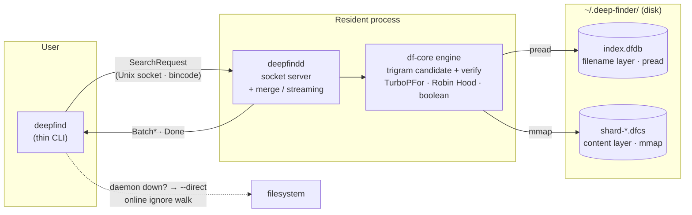
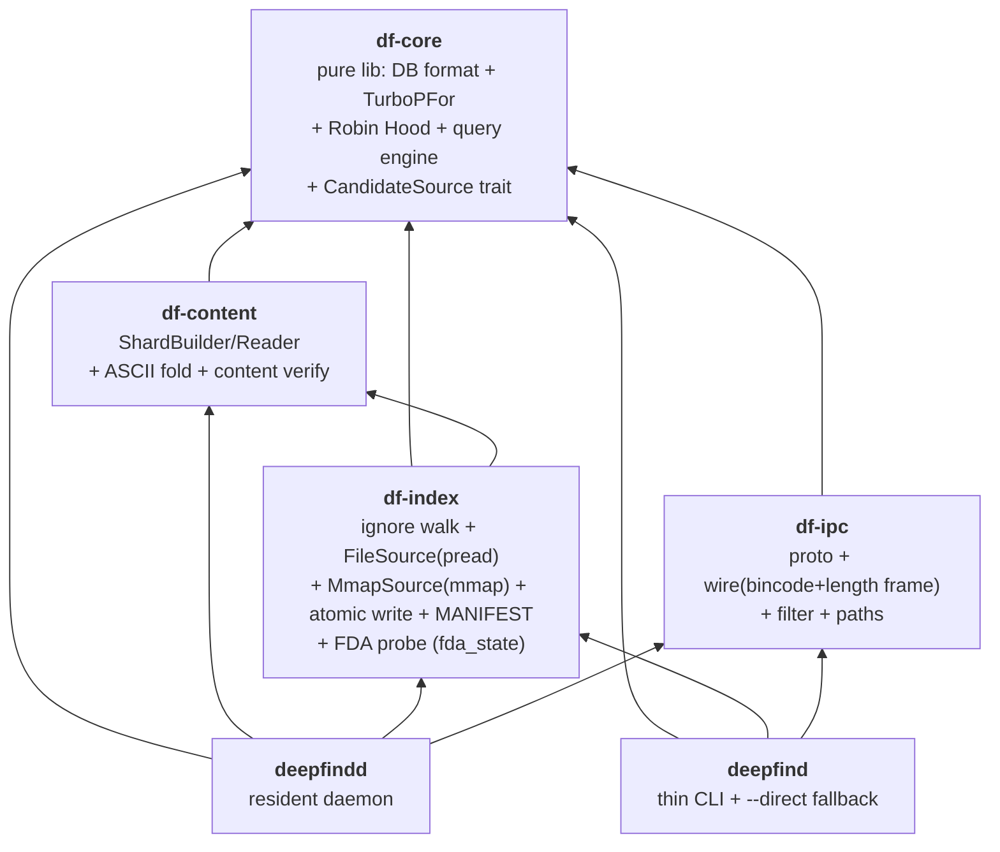
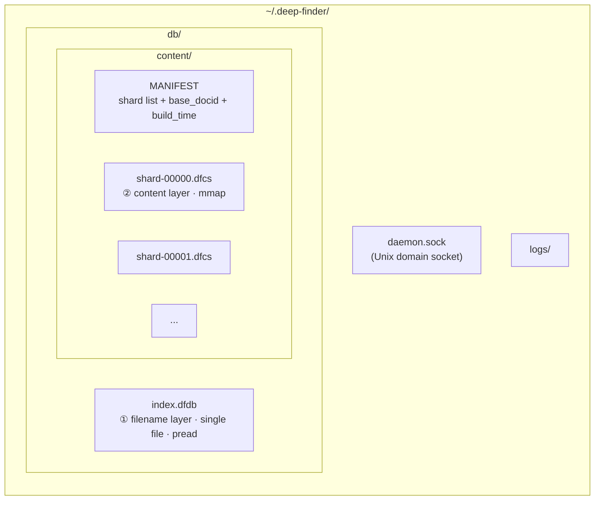
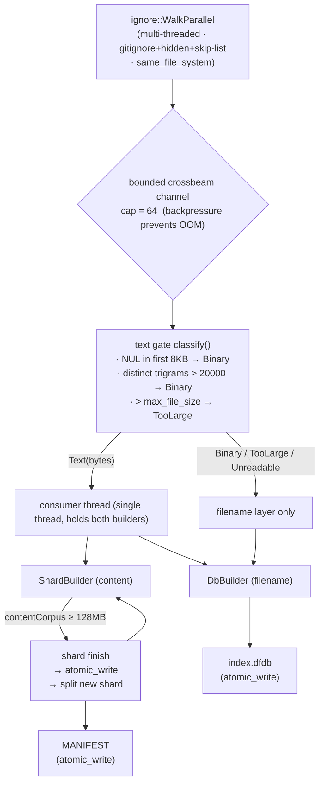
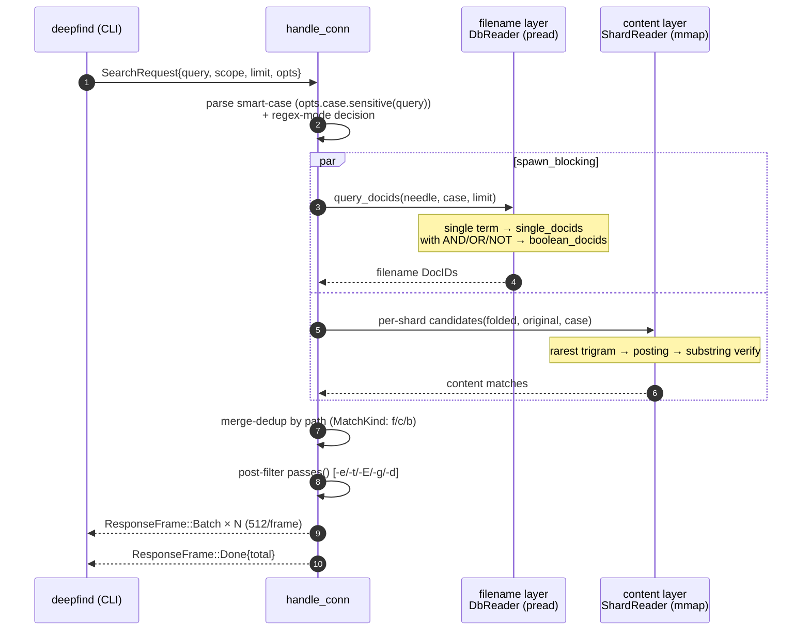
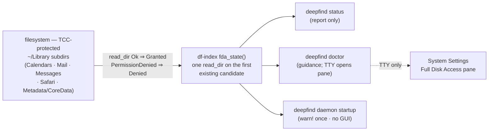

# DeepFinder — System Architecture

> **Status:** Updated 2026-06-25 to reflect the code **actually built** on `main` (not a design vision). The "complete implementation" round (Phases A–F) is fully delivered, plus Full Disk Access detection + `deepfind doctor`; 146 tests green.
> **In one sentence:** a plocate-style filename index + zoekt-style content shards, behind a single shared trigram candidate engine, served by a resident daemon over a Unix socket to a thin CLI.
> Diagrams are Mermaid (rendered natively by GitHub / VS Code / GitLab); byte-level on-disk layouts use ASCII.

---

## 1. Overview

DeepFinder is a local file-search tool for macOS, targeting fast substring search over **whole-disk filenames + content**. The architecture is a "hybrid" — it borrows one technique from each of several open-source projects and assembles them into a single engine:

| Source | Technique borrowed | Where it lands |
|---|---|---|
| **plocate** | file-level trigram + pread low RSS | the entire filename-layer paradigm |
| **zoekt** | tagged-TOC shard format, boolean, merge-dedup | `.dfcs` content shard, AST, result merging |
| **trigrep** | trigram-accelerated substring verification | shared `candidates()` candidate-gen + verify |
| **lolcate-rs** | mmap + streaming bounded build | `MmapSource`, crossbeam backpressure channel |
| **fd / bfs** | find UX + robust full-disk traversal | CLI flag set, `same_file_system`, permission-error classification |
| **reflex** | mmap fast repeated queries | daemon-resident mmap (incremental left for later) |

**Core design principles**

- **Two storage layers, one engine:** the filename layer (pread, low latency) and the content layer (mmap, GB-scale) are stored independently, but share a single "rarest-trigram candidate + substring verify" algorithm through the `CandidateSource` trait.
- **df-core is zero-I/O:** all engine/codec logic operates on a small trait (`DbSource`) implemented by one caller, so it can be unit-tested and benchmarked without a real DB.
- **Resident daemon + thin CLI:** the daemon holds the index handles; the CLI queries over a socket. If the daemon is down, the CLI automatically falls back to `--direct` online scanning, so the user is never blocked.

---

## 2. High-level architecture



---

## 3. Crate layering (6 crates, single-directional, acyclic)



| crate | responsibility | key constraint |
|---|---|---|
| **df-core** | DB format, TurboPFor codec, Robin Hood hash, query engine, `CandidateSource` trait | **pure lib, zero I/O** (operates on the `DbSource` trait) |
| **df-content** | `ShardBuilder` / `ShardReader`, ASCII fold, content substring verify | depends on df-core |
| **df-index** | `ignore` parallel walk, text gating, `FileSource` (pread), `MmapSource` (mmap), atomic write, MANIFEST, **Full Disk Access probe (`fda_state`)** | depends on df-core + df-content |
| **df-ipc** | `SearchRequest` / `ResponseFrame` proto, bincode + length frame, path filter, default paths | depends on df-core |
| **deepfindd** | resident daemon: load DB + shards, socket server, merge-dedup, streaming output | depends on all |
| **deepfind** | thin CLI: IPC client + `--direct` online fallback + highlight/exec | depends on df-core/df-index/df-ipc |

---

## 4. Dual-layer storage model

Two **fully independent** file families live under `~/.deep-finder/`, fed simultaneously by a single walk:



**Why two layers instead of one:** filenames want low latency, low RSS → a single pread file, the daemon never holds the whole DB resident; content wants GB-scale → mmap'd multi-shard, splitting when a shard's `contentCorpus` reaches ~128 MB. The two layers are unified by **the same candidate algorithm**, but their storage / access strategies are entirely different.

### 4.1 Filename DB `index.dfdb` — plocate-style, fully pread

```
┌─ Header 64B ──────────────────────────────────────────────────┐
│ magic "DFDB" | version=2 | num_docs | build_time              │
│ + 6×u64 section offsets: docs / meta / dirmtime(reserved) /   │
│                          try(hash table) / post / slots_log2  │
├───────────────────────────────────────────────────────────────┤
│ DOCS    zstd trained dictionary + block index + zstd-compressed filename blocks (N per block) │
│ META    num_docs × 17B  (is_dir:u8 | size:i64 | mtime:i64)    │
│ HASH    Robin Hood open-addressing table · 20B/slot (key|count|off|len) │
│ POST    TurboPFor (PFor delta · block=128) encoded docids     │
└───────────────────────────────────────────────────────────────┘
```
Queries go through `pread` — the resident footprint is just the dictionary + block index + currently-hit postings; everything else is read on demand.

### 4.2 Content shard `shard-NNNNN.dfcs` — zoekt-style tagged-TOC, fully mmap'd

```
┌─ body (sections back-to-back) ───────────────────────────────┐
│ metaData       version | build_time | base_docid | num_docs … │
│ fileNames      length-prefixed paths                          │
│ fileMeta       17B per doc (same as v1 LiteMeta)              │
│ contentOffsets per-doc u64 offset + u32 length → into corpus  │
│ contentCorpus  raw file bytes, concatenated by docid (~1× disk budget) │
│ ctHash         Robin Hood table (reuses v1 primitives · 20B/slot) │
│ ctPostings     TurboPFor delta-encoded local docids           │
├─ TOC ─────────────────────────────────────────────────────────┤
│ varint tag length + tag + kind + (off, sz)   ← unknown tag skipped │
├─ FOOTER 8B ───────────────────────────────────────────────────┤
│ toc_off | toc_sz        ← read last 8 bytes first to locate   │
└───────────────────────────────────────────────────────────────┘
```
Opened with `memmap2` `MAP_SHARED PROT_READ`; `metaData.base_docid` maps a local docid into the global namespace.

### 4.3 The merged docid model

A single global `u32` docid namespace spans both layers: filename docids are `0..N_name`; content shard docids are local, mapped into the global space via `base_docid + local`. **Dedup = path-keyed set union** (both layers are produced from the same walk, so they share the same canonical absolute paths), not a cross-layer string join.

---

## 5. Indexing pipeline (streaming, bounded RSS)

`deepfind index [--root] [--force] [--skip …] [--max-file-size 1MB] [--no-content] [--one-file-system]` → `build_content_index`, which builds **both layers in a single walk**:



- **Text gate** (zoekt DocChecker + trigrep idea): binary / oversized files enter **only the filename layer**, never the content layer.
- **Atomic write** = `tmp → fsync → rename`; a half-written DB is never left behind.
- **Incremental is landed** (v2.1): `df-watch` (a notify abstraction over FSEvents) watches for changes → `rebuild_and_swap` does a full-root rescan + an ArcSwap hot-swap; full rebuild is retained as the `--force` fallback. Per-file posting merge + dir-mtime incremental (F2) + MANIFEST signature (F3) are **not** done (correctness-neutral; see [decisions.md](decisions.md)).

---

## 6. Query hot path (daemon)



**Regex mode** (`-r/--regex`): the query is treated as a regex and run over **both the filename and content layers** (mirroring literal mode). The longest literal atom drives candidate generation (a case-insensitive superset); `regex.is_match` (over filename windows / mmap'd content bytes) is the authoritative verify; `(?i)` is conditioned by smart-case.

**Candidate generation `candidates()` (shared by both layers):**
1. Extract the query's byte trigrams (folded, matched against the folded index) → always a legal superset, unaffected by case mode;
2. Pick the trigram with the shortest posting → the candidate docid set;
3. Verify each candidate by substring (case-sensitive ⇒ original bytes; otherwise folded bytes);
4. <3-byte queries degrade to a linear scan of the whole DB.

---

## 7. Engine core algorithms (df-core)

| Algorithm | Implementation | Source |
|---|---|---|
| **byte-trigram key** | `(a<<16\|b<<8\|c)` bijective u32, lowercased byte sliding window | plocate · native CJK |
| **rarest-trigram candidate** | take the trigram with the shortest posting → candidate set | plocate / trigrep |
| **substring verify** | `memchr::memmem` (content) / `windows==` (filename) | trigrep |
| **TurboPFor** | **self-written**, scalar PFor delta, block=128, self-describing frame | TurboPFor paper |
| **Robin Hood hash** | splitmix32-style, open addressing, 20B/slot | v1 in-house |
| **boolean AST** | `AND/OR/NOT` + parens + implicit AND | zoekt-style |
| **ASCII fold** | A-Z→a-z (content); filename uses `to_lowercase()` | — |
| **CandidateSource trait** | `cs_posting / cs_verify / cs_num_docs` unifies both layers | this project's abstraction |

---

## 8. IPC protocol (df-ipc)

Unix domain socket (`~/.deep-finder/daemon.sock`), `LengthDelimitedCodec` (4-byte length prefix), messages `serde` + `bincode`.

```
Request                          Response frames (daemon → CLI, streaming)
─────────────                    ─────────────────────────────────────
SearchRequest {                  ResponseFrame::Batch { paths, meta, kind }
  query: String,                 ResponseFrame::Done   { total: u32 }
  scope: Option<PathBuf>,        ResponseFrame::Error  { message: String }
  limit: Option<u32>,
  opts: SearchOptions            SearchOptions:
}                                  direct, extensions, types, excludes,
                                   globs, max_depth, regex, case(CaseControl)
```
- Results return as a **batched stream** (512 paths per batch); large result sets arrive incrementally and the CLI prints as it receives.
- `SearchOptions` fields are all `#[serde(default)]` → old/new ends interoperate.
- `MatchKind`: `Filename` / `Content` / `Both` (same path hit in both layers).

---

## 9. CLI surface (current)

```
deepfind index   [--root] [--force] [--skip NAME…] [--max-file-size N]
                 [--no-content] [--one-file-system] [-H/--hidden]
deepfind daemon
deepfind status
deepfind doctor                 # self-diagnostic: Full Disk Access check + guidance
deepfind db      add <name> <root> [--max-file-size N]
                 remove <name>   |   list
deepfind install [--no-watch]      # macOS: install user LaunchAgent (login auto-start + KeepAlive + optional df-watch)
deepfind uninstall                # stop daemon + delete plist
deepfind search <query>
    # match modes
    [-r/--regex | default literal substring]   [-i | -s]   (default smart-case)
    [-p/--full-path | -b/--basename]
    # filters
    [-e EXT] [-t TYPE(code|docs|config|web|archive|media)] [-E EXCLUDE]
    [-g GLOB] [-d N]   [--scope PATH] [--limit N] [--max-results N]
    [--sort default|path|kind|none]   [--expr EXPR]   [--db NAME]
    # content
    [-n/--line-number] [-C N]   [--content | --filename]
    # output
    [-l] [--color always|never|auto] [-0/--null] [--count]
    # fallback / actions
    [--direct]   [-x CMD]   [-H/--hidden]
```

**`--expr`** is a bfs/find-style advanced expression (`-name/-path/-size/-newer` + boolean + parens), evaluated post-query against `(path, LiteMeta)`; it **coexists with** `-e/-t/-E/-g/-d`, it does not replace them. `-n/-C` output goes over a separate `ResponseFrame::Lines` stream (`path:line:text`, grep-aligned).

---

## 10. Full Disk Access detection (operational)

DeepFinder reads the whole disk — including TCC-protected `~/Library` subdirs (`Mail`, `Messages`, `Safari`, `Calendars`, …) — so the process must hold **Full Disk Access (FDA)**. macOS exposes **no API** to query or grant FDA, and no consent prompt an app can trigger (unlike Accessibility). So DeepFinder **probes** heuristically and **guides** the user to the Settings pane; it cannot auto-grant.



- **Probe** (`crates/df-index/src/permissions.rs`): `fda_state()` does **one** `read_dir` on the first existing TCC-protected candidate — `Ok` ⇒ `Granted`, `PermissionDenied` ⇒ `Denied`, absent/non-mac ⇒ `Unknown`. No side effects, no cache (one `readdir` is cheap). Lives in `df-index` (the fs-I/O layer) so **`df-core` stays pure**.
- **Same binary ⇒ same verdict:** `deepfind daemon` and the CLI are the **same `deepfind` binary** (`deepfindd` is a linked lib), so a local CLI probe equals the daemon's FDA state — no need to ask the daemon over the socket, no "daemon down ⇒ Unknown" path.
- **Three exit surfaces:** `status` (report, no popup); `doctor` (human self-check — on a TTY it auto-`open`s the FDA pane and prints the exact `current_exe()` path + the `launchctl kickstart -k` restart command; non-TTY prints guidance only); daemon startup (`tracing::warn!` once if `Denied`, never pops a GUI).
- **No `permissions grant`:** physically impossible for FDA — the user must add the binary manually in System Settings. The doctor's auto-`open` only navigates to the pane.

---

## 11. Current status and known gaps (honest inventory)

**Built and verified** (Phases A–F all delivered): dual-layer trigram (pread filename + mmap content) × shared candidate engine × daemon + CLI process model × smart-case × boolean AST × **filename + content regex** × `-n/-C` line-number context × layer-selection / path-mode / hidden / sort / early-exit × bfs `--expr` × **multi-DB** × **lockless ArcSwap hot-swap + df-watch incremental (rebuild_and_swap)** × **Full Disk Access detection + `deepfind doctor` guidance**. 146 tests green, clippy/fmt clean, daemon + CLI verified end-to-end. Decision detail in [decisions.md](decisions.md); baselines in [perf-baseline.md](perf-baseline.md).

**Designed but not yet built** (the M7 performance-hardening layer + unbuilt incremental items — D2 left **none** in place after measurement this round):

| Gap | Impact / current state |
|---|---|
| Content trigram is Robin Hood only, **no ASCII direct-index array** (spec §6 zero-hash fast path) | every content trigram query pays a hash; only pays off on a large corpus |
| Candidate generation takes only the **single rarest** trigram | **2-rarest was implemented + benchmarked, then reverted** — for literal substrings the trigrams co-occur contiguously, so intersecting barely narrows the set (decisions.md D2.1) |
| <3-byte query does a **linear scan of the whole DB** (no bigram index) | 2-character queries are slow; fixing needs a DB format change, not worth it at baseline scale |
| **No dirTable** → `--scope` is a post-query path filter, not shard-level pruning | a scope query cannot skip an entire shard |
| Content query is a **sequential loop** (no per-shard parallelism) | latency grows linearly with shard count |
| No `madvise` hints / RLIMIT_NOFILE bump / `.git`-sentinel subtree pruning | large-scale tuning is weak |
| Incremental is a **full-root rescan** `rebuild_and_swap`, not a per-file posting merge | per-file incremental merge is high-risk and not done; dir-mtime incremental (F2), MANIFEST signature (F3) deferred — correctness-neutral |

**Explicitly future** (not gaps, a roadmap): GUI / interactive TUI, positional trigram / phrase search, pinyin/jieba, SIMD decode.

---

## Appendix A: Data-flow overview

| Scenario | Path |
|---|---|
| **Index (cold)** | `deepfind index` → df-index streaming build → both layers written atomically (no daemon needed) |
| **Query (hot)** | CLI → socket → daemon `handle_conn` → filename ∥ content → merge-dedup → streamed back |
| **Fallback** | daemon unavailable / socket error → CLI `--direct` (`ignore` walk + online substring) |

## Appendix B: Build and verify

```
cargo build --workspace
cargo test --workspace          # 146 tests
cargo clippy --workspace --all-targets -D warnings
cargo fmt --all -- --check
```

## Appendix C: Key file index

| Concern | Location |
|---|---|
| candidate-gen + verify | `crates/df-core/src/candidate.rs` |
| filename DB format / DbReader | `crates/df-core/src/db.rs` |
| query dispatch + boolean | `crates/df-core/src/query.rs`, `boolquery.rs` |
| TurboPFor / Robin Hood | `crates/df-core/src/turbopfor.rs`, `db.rs` |
| content shard format / verify | `crates/df-content/src/shard.rs`, `fold.rs` |
| streaming build + text gate | `crates/df-index/src/content_build.rs` |
| pread/mmap source | `crates/df-index/src/lib.rs`, `mmap_source.rs` |
| Full Disk Access probe | `crates/df-index/src/permissions.rs` |
| IPC proto / wire / filter | `crates/df-ipc/src/{proto,wire,filter,paths}.rs` |
| daemon query merge / streaming | `crates/deepfindd/src/lib.rs` |
| CLI | `crates/deepfind/src/main.rs` |
