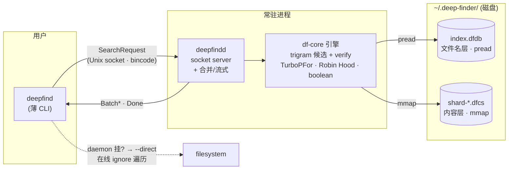
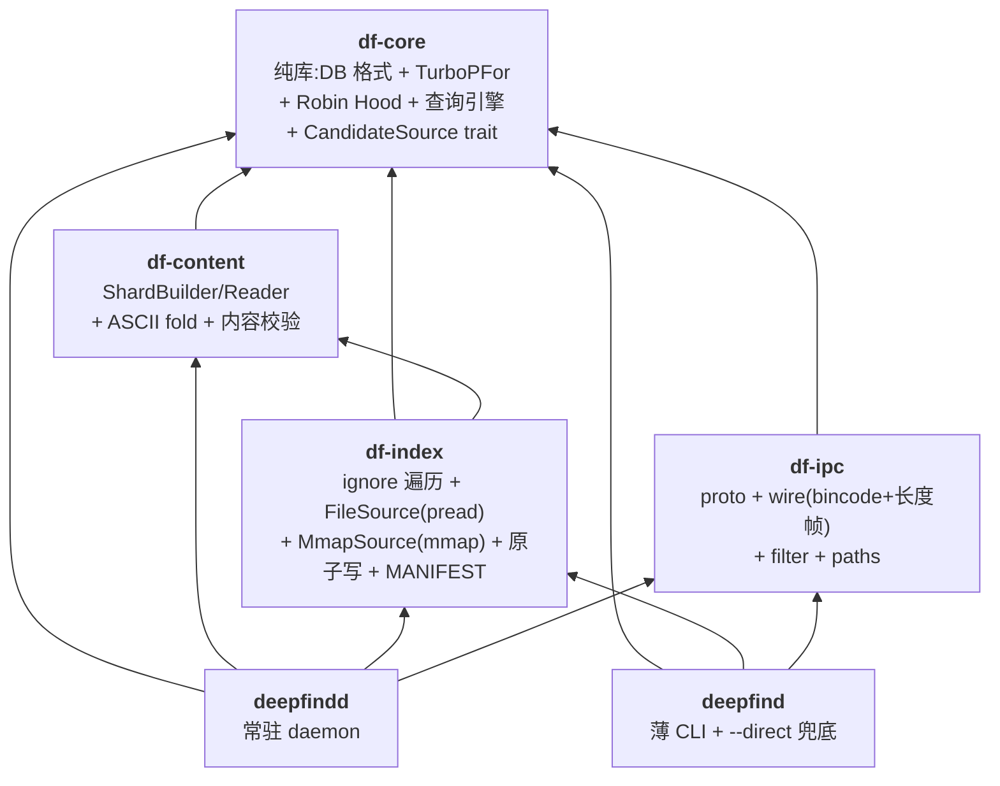
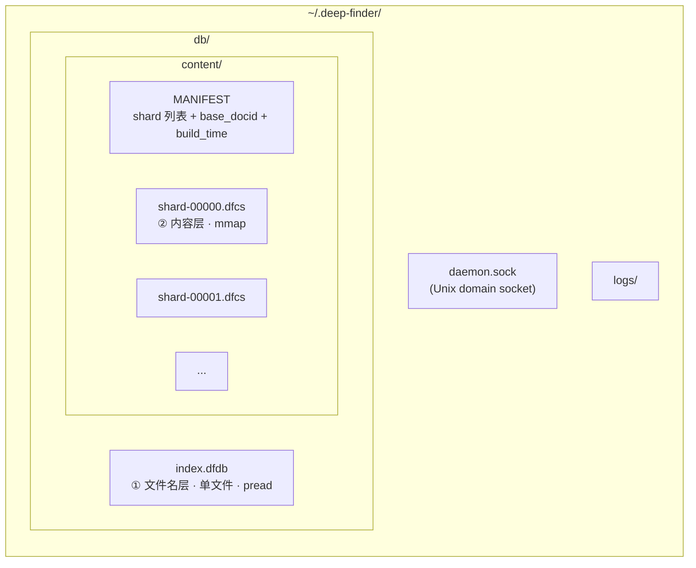
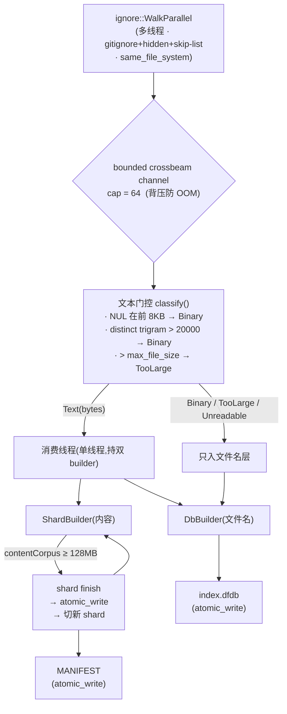
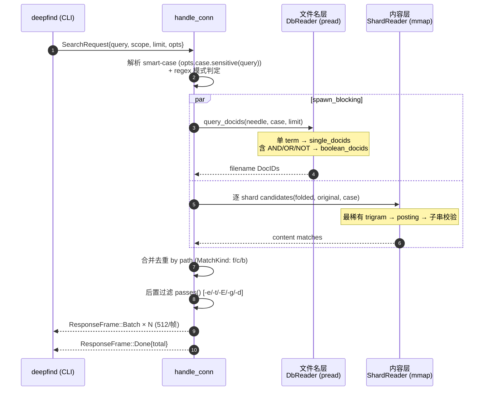

# DeepFinder — System Architecture

> **状态**:2026-06-24 更新,反映 `main` 上**实际建成**的代码(非设计愿景)。本轮「完整实现」(Phase A–F)已全部交付,131 测试绿。
> **一句话**:**plocate 式文件名索引 + zoekt 式内容 shard,套同一个 trigram 候选引擎,由常驻 daemon 经 Unix socket 服务薄 CLI。**
> 图示为 Mermaid(GitHub / VS Code / GitLab 原生渲染);字节级磁盘布局用 ASCII。

---

## 1. 概述

DeepFinder 是 macOS 上的本地文件搜索工具,目标是**全盘文件名 + 内容**的快速子串搜索。架构是"混合"的——从多个开源项目各取一技,拼成一个统一引擎:

| 来源 | 借鉴的技术 | 落地点 |
|---|---|---|
| **plocate** | 文件级 trigram + pread 低 RSS | 文件名层整个范式 |
| **zoekt** | tagged-TOC shard 格式、boolean、合并去重 | `.dfcs` 内容 shard、AST、结果合并 |
| **trigrep** | trigram 加速的子串校验 | 共享 `candidates()` 候选 + verify |
| **lolcate-rs** | mmap + 流式 bounded 构建 | `MmapSource`、crossbeam 背压通道 |
| **fd / bfs** | find UX + 鲁棒全盘遍历 | CLI flag 集、`same_file_system`、权限错误分类 |
| **reflex** | mmap 快速复查询 | daemon 常驻 mmap(增量留作未来) |

**核心设计原则**

- **双层存储,一个引擎**:文件名层(pread,低延迟)与内容层(mmap,GB 级)独立存储,但经 `CandidateSource` trait 共享同一套"最稀有 trigram 候选 + 子串校验"算法。
- **df-core 零 I/O**:所有引擎/codec 逻辑对一个 caller 实现的小 trait(`DbSource`)操作,可脱离真实 DB 单测 + bench。
- **常驻 daemon + 薄 CLI**:daemon 持索引句柄,CLI 经 socket 查询;daemon 挂掉时 CLI 自动落 `--direct` 在线直扫,用户永不阻塞。

---

## 2. 高层架构



---

## 3. Crate 分层(6 crate,单向无环)



| crate | 职责 | 关键约束 |
|---|---|---|
| **df-core** | DB 格式、TurboPFor codec、Robin Hood 哈希、查询引擎、`CandidateSource` trait | **纯库,零 I/O**(对 `DbSource` trait 操作) |
| **df-content** | `ShardBuilder` / `ShardReader`、ASCII fold、内容子串校验 | 依赖 df-core |
| **df-index** | `ignore` 并行遍历、文本门控、`FileSource`(pread)、`MmapSource`(mmap)、原子写、MANIFEST | 依赖 df-core + df-content |
| **df-ipc** | `SearchRequest`/`ResponseFrame` proto、bincode+长度帧、路径过滤、默认路径 | 依赖 df-core |
| **deepfindd** | 常驻 daemon:载 DB+shard、socket server、合并去重、流式输出 | 依赖全部 |
| **deepfind** | 薄 CLI:IPC 客户端 + `--direct` 在线兜底 + 高亮/exec | 依赖 df-core/df-index/df-ipc |

---

## 4. 双层存储模型

`~/.deep-finder/` 下两个**完全独立**的文件族,一次遍历同时喂养两个 builder:



**为什么是两层而非一层**:文件名要低延迟、低 RSS → pread 单文件,daemon 不整库驻留;内容要 GB 级 → mmap 多 shard,每 shard ~128 MB contentCorpus 触发切分。两层用**同一套候选算法**统一,但存储/访问策略完全不同。

### 4.1 文件名 DB `index.dfdb` — plocate 式,全 pread

```
┌─ Header 64B ──────────────────────────────────────────────────┐
│ magic "DFDB" | version=2 | num_docs | build_time              │
│ + 6×u64 section offsets: docs / meta / dirmtime(预留) /       │
│                          try(hash表) / post / slots_log2      │
├───────────────────────────────────────────────────────────────┤
│ DOCS    zstd 训练字典 + 块索引 + zstd 压缩文件名块(每块 N 条) │
│ META    num_docs × 17B  (is_dir:u8 | size:i64 | mtime:i64)    │
│ HASH    Robin Hood 开放寻址表 · 20B/槽 (key|count|off|len)    │
│ POST    TurboPFor (PFor delta · block=128) 编码的 docid       │
└───────────────────────────────────────────────────────────────┘
```
查询走 `pread`——常驻内存仅 = 字典 + 块索引 + 当前命中的 posting,其余按需读取。

### 4.2 内容 shard `shard-NNNNN.dfcs` — zoekt 式 tagged-TOC,全 mmap

```
┌─ body(各 section 背靠背)──────────────────────────────────────┐
│ metaData       version | build_time | base_docid | num_docs …  │
│ fileNames      长度前缀路径                                    │
│ fileMeta       每文档 17B(同 v1 LiteMeta)                    │
│ contentOffsets 每文档 u64 偏移 + u32 长度 → 指向 corpus        │
│ contentCorpus  原始文件字节,按 docid 拼接(~1× 磁盘预算)     │
│ ctHash         Robin Hood 表(复用 v1 原语 · 20B/槽)          │
│ ctPostings     TurboPFor delta 编码的 local docid             │
├─ TOC ─────────────────────────────────────────────────────────┤
│ varint tag 长度 + tag + kind + (off, sz)   ← 未知 tag 跳过    │
├─ FOOTER 8B ───────────────────────────────────────────────────┤
│ toc_off | toc_sz        ← 读文件先读末 8 字节定位            │
└───────────────────────────────────────────────────────────────┘
```
`memmap2` MAP_SHARED PROT_READ 打开;`metaData.base_docid` 把 local docid 映射进全局命名空间。

### 4.3 合并的 docid 模型

单一全局 `u32` docid 命名空间横跨两层:文件名 docid `0..N_name`;内容 shard docid 是 local,经 `base_docid + local` 映射到全局。**去重 = 路径键集合 union**(两层从同一次遍历产生相同规范绝对路径),不是跨层字符串 join。

---

## 5. 索引管线(流式,bounded RSS)

`deepfind index [--root] [--force] [--skip …] [--max-file-size 1MB] [--no-content] [--one-file-system]` → `build_content_index`,**单次遍历同时建两层**:



- **文本门控**(zoekt DocChecker + trigrep 思路):二进制/超尺寸文件**只入文件名层**,不入内容层。
- **原子写** = `tmp → fsync → rename`,绝不留半截库。
- **增量已落地**(v2.1):`df-watch`(notify 抽象 FSEvents)监听变化 → `rebuild_and_swap` 全根重扫 + ArcSwap 热换;全量重建保留作 `--force` 兜底。每文件 posting 合并 + dir-mtime 增量(F2)+ MANIFEST 签名(F3)未做(正确性中性,见 [decisions.md](decisions.md))。

---

## 6. 查询热路径(daemon)



**regex 模式**(`-r/--regex`):query 作正则,**文件名与内容两层都跑**(镜像字面模式)。取最长字面 atom 驱动候选生成(case-insensitive 超集),`regex.is_match`(文件名 windows / 内容 mmap 字节)做权威校验;`(?i)` 由 smart-case 条件化。

**候选生成 `candidates()`(两层共享)**:
1. 抽 query 的字节 trigram(folded,匹配 folded 索引)→ 永远是合法超集,不受 case 模式影响;
2. 选 posting 最短的那条 trigram → 候选 docid 集;
3. 逐候选 verify 子串(case-sensitive ⇒ 原始字节;否则 folded 字节);
4. <3 字节 query 退化为线性扫全库。

---

## 7. 引擎核心算法(df-core)

| 算法 | 实现 | 来源 |
|---|---|---|
| **字节 trigram 键** | `(a<<16\|b<<8\|c)` 双射 u32,小写化字节滑动窗口 | plocate · CJK 原生 |
| **最稀有 trigram 候选** | 取 posting 最短的 trigram → 候选集 | plocate / trigrep |
| **子串校验** | `memchr::memmem`(content)/ `windows==`(filename) | trigrep |
| **TurboPFor** | **自写**,标量 PFor delta,block=128,自描述帧 | TurboPFor 论文 |
| **Robin Hood 哈希** | splitmix32 式,开放寻址,20B 槽 | v1 自建 |
| **boolean AST** | `AND/OR/NOT` + 括号 + 隐式 AND | zoekt 风格 |
| **ASCII fold** | A-Z→a-z(content);filename 用 `to_lowercase()` | — |
| **CandidateSource trait** | `cs_posting / cs_verify / cs_num_docs` 统一两层 | 本项目抽象 |

---

## 8. IPC 协议(df-ipc)

Unix domain socket(`~/.deep-finder/daemon.sock`),`LengthDelimitedCodec`(4 字节长度前缀),消息 `serde` + `bincode`。

```
Request                          Response frames (daemon → CLI,流式)
─────────────                    ─────────────────────────────────────
SearchRequest {                  ResponseFrame::Batch { paths, meta, kind }
  query: String,                 ResponseFrame::Done   { total: u32 }
  scope: Option<PathBuf>,        ResponseFrame::Error  { message: String }
  limit: Option<u32>,
  opts: SearchOptions            SearchOptions:
}                                  direct, extensions, types, excludes,
                                   globs, max_depth, regex, case(CaseControl)
```
- 结果以 **batched stream**(每批 512 路径)返回,大批结果增量到达,CLI 边收边打印。
- `SearchOptions` 字段全 `#[serde(default)]` → 新旧端互通。
- `MatchKind`: `Filename` / `Content` / `Both`(同路径命中两层)。

---

## 9. CLI 能力面(当前)

```
deepfind index   [--root] [--force] [--skip NAME…] [--max-file-size N]
                 [--no-content] [--one-file-system] [-H/--hidden]
deepfind daemon
deepfind status
deepfind db      add <name> <root> [--max-file-size N]
                 remove <name>   |   list
deepfind install [--no-watch]      # macOS:装用户 LaunchAgent(登录自启 + KeepAlive + 可选 df-watch)
deepfind uninstall                # 停 daemon + 删 plist
deepfind search <query>
    # 匹配模式
    [-r/--regex | 默认字面子串]   [-i | -s]   (默认 smart-case)
    [-p/--full-path | -b/--basename]
    # 过滤
    [-e EXT] [-t TYPE(code|docs|config|web|archive|media)] [-E EXCLUDE]
    [-g GLOB] [-d N]   [--scope PATH] [--limit N] [--max-results N]
    [--sort default|path|kind|none]   [--expr EXPR]   [--db NAME]
    # 内容
    [-n/--line-number] [-C N]   [--content | --filename]
    # 输出
    [-l] [--color always|never|auto] [-0/--null] [--count]
    # 兜底 / 动作
    [--direct]   [-x CMD]   [-H/--hidden]
```

**`--expr`** 是 bfs/find 式高级表达式(`-name/-path/-size/-newer` + 布尔 + 括号),查询后对 `(path, LiteMeta)` 求值,**与 `-e/-t/-E/-g/-d` 并存**不替换。`-n/-C` 输出走独立 `ResponseFrame::Lines` 流(`path:line:text`,grep 对齐)。

---

## 10. 当前状态与已知缺口(诚实清单)

**已建成并验证**(Phase A–F 全交付):双层 trigram(pread 文件名 + mmap 内容)× 共享候选引擎 × daemon+CLI 进程模型 × smart-case × boolean AST × **文件名+内容正则** × `-n/-C` 行号上下文 × 层选择/路径模式/隐藏/排序/早退 × bfs `--expr` × **多 DB** × **ArcSwap 无锁热换 + df-watch 增量(rebuild_and_swap)**。131 测试绿,clippy/fmt 干净,daemon+CLI 端到端验证。决策细节见 [decisions.md](decisions.md),基线见 [perf-baseline.md](perf-baseline.md)。

**设计写了、代码还没建**(M7 性能硬化层 + 增量未做项——D2 经测量本轮**未留一项**):

| 缺口 | 影响 / 现状 |
|---|---|
| 内容 trigram 仅 Robin Hood,**无 ASCII 直索引数组**(spec §6 零哈希快路径) | 所有内容 trigram 查询都要 hash;需大语料才显效 |
| 候选生成只取**单条最稀有** trigram | **2-rarest 已实现+基准后回退**——字面子串的 trigram 连续共现,交集几乎不收窄(decisions.md D2.1) |
| <3 字节 query **线性扫全库**(无 bigram 索引) | 2 字符查询慢;需改 DB 格式,基线不值得 |
| **无 dirTable** → `--scope` 是查后路径过滤,非 shard 级剪枝 | scope 查询不能跳过整个 shard |
| 内容查询**顺序循环**(无 per-shard 并行) | 大 shard 数时延迟线性增长 |
| 无 `madvise` 提示 / RLIMIT_NOFILE 提升 / `.git`-sentinel 子树剪枝 | 大规模调优欠佳 |
| 增量是**全根重扫** `rebuild_and_swap`,非每文件 posting 合并 | 每文件增量合并高风险未做;dir-mtime 增量(F2)、MANIFEST 签名(F3)延后——正确性中性 |

**明确未来**(非缺口,是路线图):GUI / 交互式 TUI、位置 trigram / 短语搜索、pinyin/jieba、SIMD 解码。

---

## 附录 A:数据流总览

| 场景 | 路径 |
|---|---|
| **索引(冷)** | `deepfind index` → df-index 流式构建 → 两层原子写盘(无需 daemon) |
| **查询(热)** | CLI → socket → daemon `handle_conn` → 文件名 ∥ 内容 → 合并去重 → 流式回 |
| **兜底** | daemon 不可用/socket 错 → CLI `--direct`(`ignore` 遍历 + 在线子串) |

## 附录 B:构建与验证

```
cargo build --workspace
cargo test --workspace          # 131 tests
cargo clippy --workspace --all-targets -D warnings
cargo fmt --all -- --check
```

## 附录 C:关键文件索引

| 关注点 | 位置 |
|---|---|
| 候选生成 + verify | `crates/df-core/src/candidate.rs` |
| 文件名 DB 格式 / DbReader | `crates/df-core/src/db.rs` |
| 查询分发 + boolean | `crates/df-core/src/query.rs`、`boolquery.rs` |
| TurboPFor / Robin Hood | `crates/df-core/src/turbopfor.rs`、`db.rs` |
| 内容 shard 格式 / 校验 | `crates/df-content/src/shard.rs`、`fold.rs` |
| 流式构建 + 文本门控 | `crates/df-index/src/content_build.rs` |
| pread/mmap source | `crates/df-index/src/lib.rs`、`mmap_source.rs` |
| IPC proto / wire / filter | `crates/df-ipc/src/{proto,wire,filter,paths}.rs` |
| daemon 查询合并 / 流式 | `crates/deepfindd/src/lib.rs` |
| CLI | `crates/deepfind/src/main.rs` |
